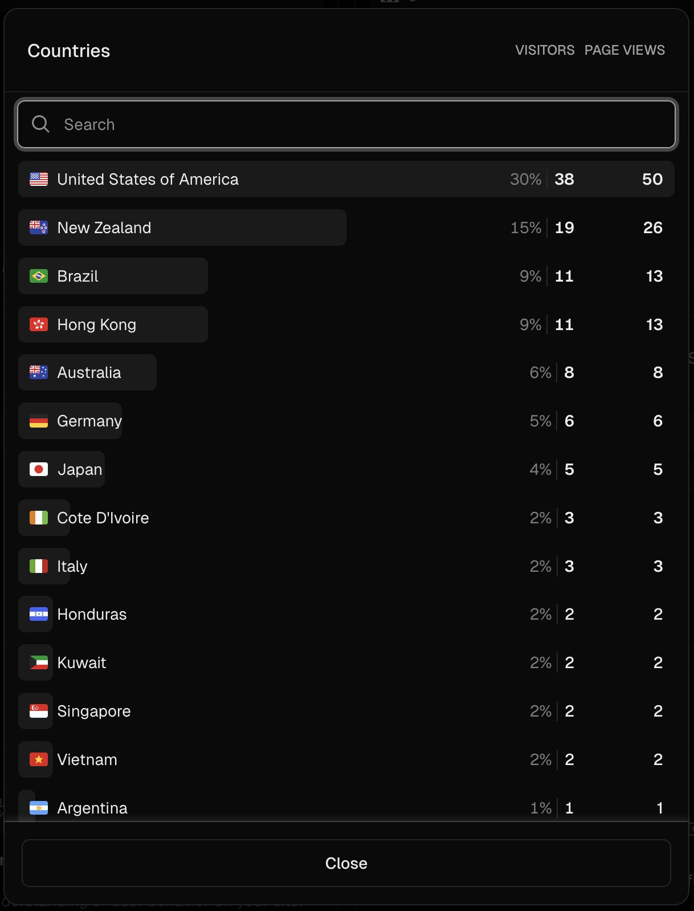

# Learning English From The News(2025 Kong Hackathon Project)

## Team
- Lisen Huang
- Michael Tenorio
- Shiela Marie Umali

## Quick Start
1. Copy the example environment variables: `cp .env.local.example .env.local`, then add your own API keys.
2. Install dependencies: `pnpm install`.
3. Run the development server: `pnpm run dev`.

This project is continuously deployed to Vercel at https://news.english-dictionary.app, so you can preview the latest build without any setup.

## Project Overview
This App helps learners practice listening to a wide range of English accents. After the user picks a native language and target news regions, the frontend calls a backend API that, via Kong, reaches OpenAI. The model actively researches the latest news, orders it by recency, produces concise summaries, and returns the results — an agentic loop of autonomous browsing, reasoning, and synthesis. Once the frontend receives the news data, it shows them in the UI and can hand each article to Gemini to generate accent-specific audio clips, giving learners fresh material for accent training.

Even with zero promotion after launch, more than 100 learners from dozens of countries explored the app in the past 30 days (Aug 29 – Sep 29, 2025). The snapshots below show the visit volume and geographic spread.




## Intro Video
▶️ [Watch the project walkthrough](https://peach-cautious-rattlesnake-559.mypinata.cloud/ipfs/bafybeibduxm3hiovtjpjpngrbvbasfoskjjioiddggyeo6wwnwxroqdnf4)

## Kong API Usage
- The news generation logic lives in `app/api/news/openai/route.ts`. It calls the Kong-hosted OpenAI proxy at `https://kong-5b384bb73cauxw7mq.kongcloud.dev/openai/chat` so every request benefits from Kong's gateway features (auth, traffic shaping, observability).
- The endpoint accepts a JSON payload with `language`, `regions`, `level`, and optional `skipCache`. It returns curated articles with translations.

Example invocation inside the route:

```ts
const res = await fetch("https://kong-5b384bb73cauxw7mq.kongcloud.dev/openai/chat", {
  method: "POST",
  headers: {
    "Content-Type": "application/json",
    Authorization: `Bearer ${process.env.OPENAI_API_KEY}`,
  },
  body: JSON.stringify({
    model: "gpt-4.1",
    messages: [
      {
        role: "user",
        content: prompt,
      },
    ],
  }),
});
```

The same payload works against the Vercel deployment by swapping the base URL with https://news.english-dictionary.app.
